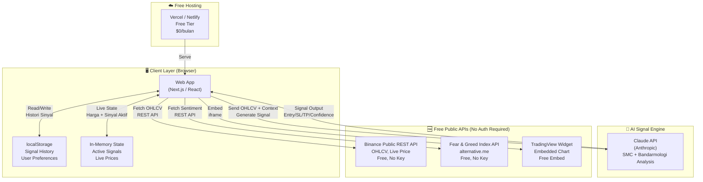
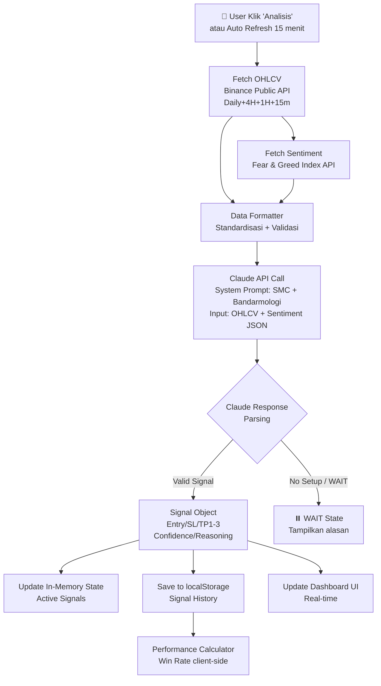
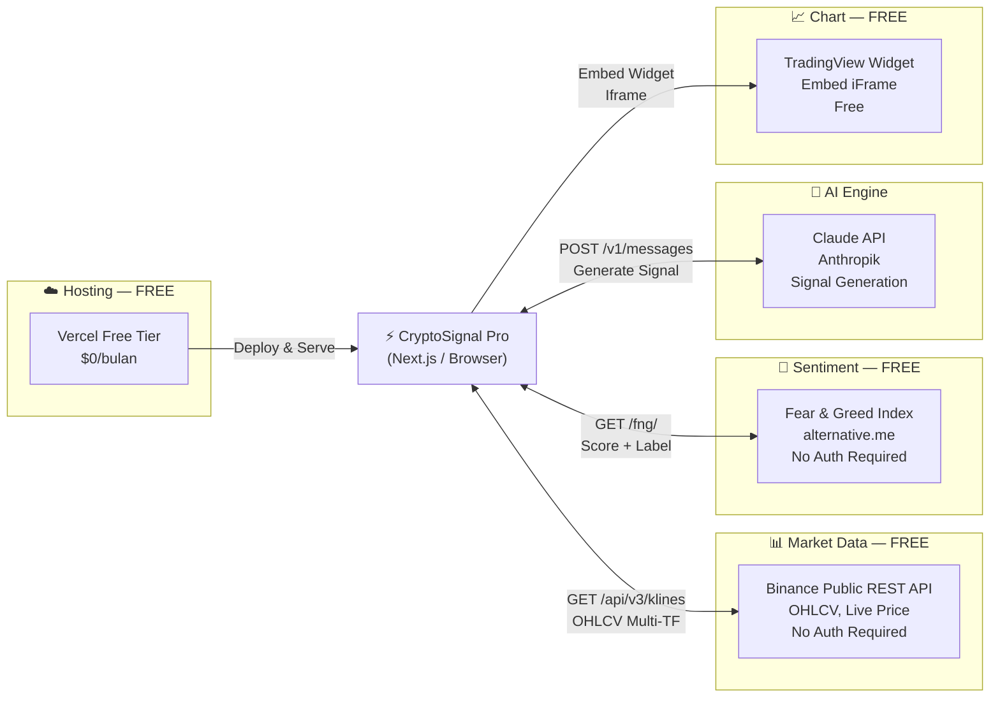
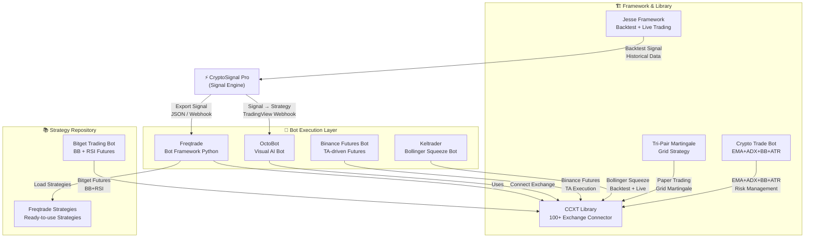
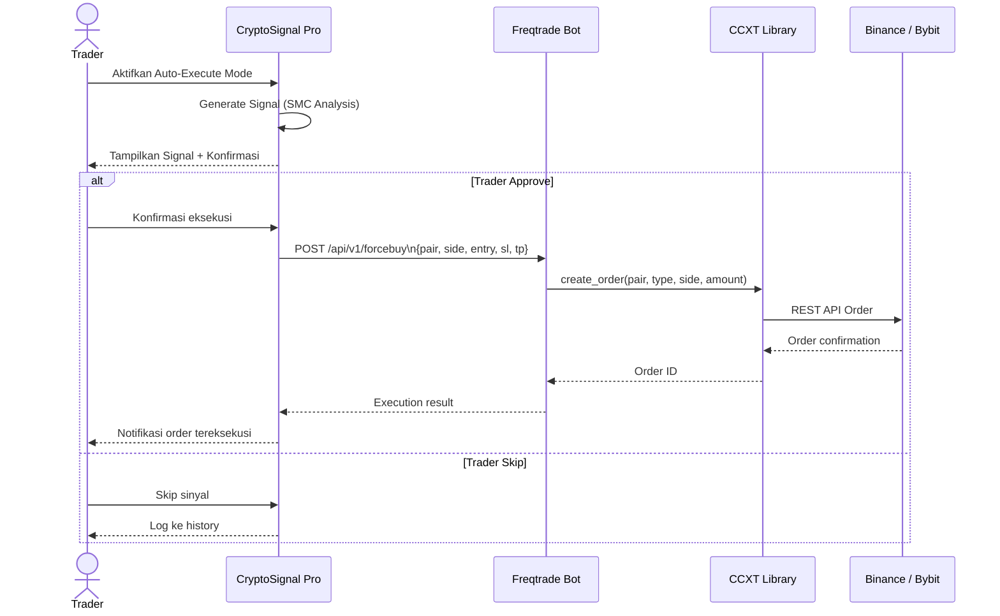
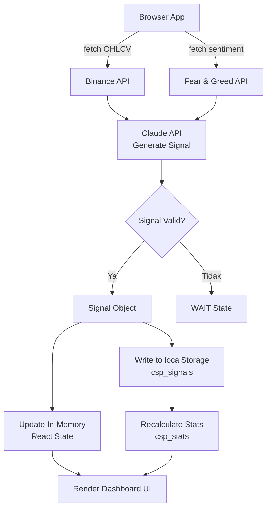
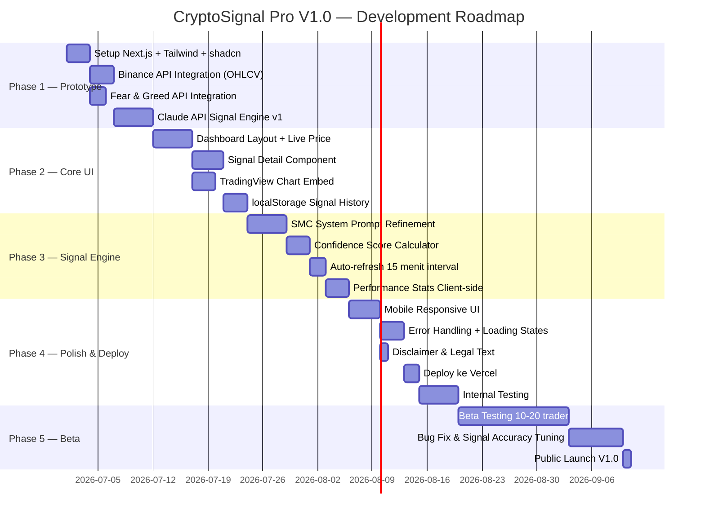

# 📄 Product Requirements Document (PRD)
## CryptoSignal Pro — BTC/ETH Trading Decision System

---

| Atribut | Detail |
|---|---|
| **Dokumen** | Product Requirements Document (PRD) |
| **Versi** | 1.2.0 |
| **Status** | Draft — Updated |
| **Tanggal** | 23 Juni 2026 |
| **Revisi** | 23 Juni 2026 — V1.2: Tambah Open Source Trading Bot Ecosystem |
| **Author** | System Analyst Team |
| **Audience** | Product Owner, Developer, QA, Investor |

---

## 📋 DAFTAR ISI

1. [Executive Summary](#1-executive-summary)
2. [Problem Statement](#2-problem-statement)
3. [Goals & Success Metrics](#3-goals--success-metrics)
4. [Scope & Asumsi](#4-scope--asumsi)
5. [Stakeholder & User Persona](#5-stakeholder--user-persona)
6. [Fitur & Functional Requirements](#6-fitur--functional-requirements)
7. [Non-Functional Requirements](#7-non-functional-requirements)
8. [Arsitektur Sistem & Tech Stack](#8-arsitektur-sistem--tech-stack)
9. [Integrasi Eksternal](#9-integrasi-eksternal)
10. [Open Source Trading Bot Ecosystem](#10-open-source-trading-bot-ecosystem)
11. [Data Model & localStorage Schema](#11-data-model--localstorage-schema)
12. [User Flow & Wireframe Deskripsi](#12-user-flow--wireframe-deskripsi)
13. [Analisis Signal Engine](#13-analisis-signal-engine)
14. [Risk & Mitigasi](#14-risk--mitigasi)
15. [Roadmap & Milestone](#15-roadmap--milestone)
16. [Referensi & Glossary](#16-referensi--glossary)

---

## 1. Executive Summary

**CryptoSignal Pro** adalah aplikasi trading decision system berbasis web yang dirancang untuk membantu trader BTC dan ETH dalam menentukan keputusan entry, Stop Loss (SL), dan Take Profit (TP) — baik untuk posisi **Long maupun Short** — dengan tingkat akurasi prediksi target **80–90%** pada kondisi pasar trending.

Sistem ini mengintegrasikan **data market real-time gratis** dari Binance Public REST API (OHLCV, harga live), **sentiment pasar** dari Fear & Greed Index API, serta **AI Signal Engine berbasis Claude API** yang men-generate sinyal trading dengan confidence score terukur — semua tanpa biaya infrastruktur API berbayar.

**V1.0 dibangun dengan filosofi Zero-Database, Zero-Paid-API**: seluruh state aplikasi dikelola di browser (localStorage + in-memory), data market diambil dari endpoint publik gratis, dan signal engine ditenagai Claude API yang sudah tersedia. Tidak ada backend server, tidak ada database, tidak ada biaya subscription API eksternal. Aplikasi dapat di-deploy gratis di Vercel atau Netlify.

CryptoSignal Pro bukan robot trading otomatis — melainkan **decision support system** yang meningkatkan kualitas keputusan trader dengan mengurangi bias emosional dan menyediakan analisis terstruktur yang actionable.

Untuk pengguna yang ingin melangkah lebih jauh ke **eksekusi otomatis**, PRD ini mendokumentasikan ekosistem **open source trading bot** (Freqtrade, OctoBot, Jesse, CCXT, dan lainnya) sebagai referensi integrasi lanjutan di roadmap V2.0+.

---

## 2. Problem Statement

### 2.1 Latar Belakang

Pasar cryptocurrency bersifat **highly volatile** dan **24/7**, membuat trader ritel menghadapi tantangan besar:

- **Information overload** — terlalu banyak indikator, berita, dan sinyal yang saling bertentangan
- **Emotional trading** — keputusan buy/sell yang dipengaruhi FOMO (Fear of Missing Out) dan FUD (Fear, Uncertainty, Doubt)
- **Kurangnya framework analisis** — trader pemula tidak punya metodologi yang konsisten
- **Multi-timeframe analysis** — sulit membaca confluence antara timeframe berbeda secara manual
- **Bandarmologi blind spot** — pergerakan "smart money" (bandar/whale) sulit terdeteksi tanpa tools khusus

### 2.2 Pain Points Trader

| Segmen | Pain Point | Dampak |
|---|---|---|
| Trader Pemula | Tidak tahu kapan entry yang tepat | Sering buy di top, sell di bottom |
| Trader Intermediate | Susah baca confluence multi-TF | Miss entry yang bagus |
| Trader Advanced | Butuh waktu lama untuk analisis manual | Terlambat entry karena analisis lambat |
| Semua Segmen | Tidak ada SL/TP yang objektif | Over-leverage, margin call |

### 2.3 Opportunity

- Komunitas trader kripto Indonesia terus berkembang (estimasi 20+ juta akun exchange aktif per 2025)
- Penetrasi tools analisis berbayar masih rendah di segmen ritel Indonesia
- AI + real-time data membuka peluang akurasi analisis yang tidak mungkin dilakukan manual

---

## 3. Goals & Success Metrics

### 3.1 Business Goals

| # | Goal | Target |
|---|---|---|
| G1 | Signal accuracy rate | ≥ 80% pada trending market |
| G2 | User retention (30 hari) | ≥ 60% |
| G3 | Daily Active Users (DAU) bulan ke-6 | ≥ 5.000 user |
| G4 | Conversion Free → Premium | ≥ 15% |
| G5 | Revenue MRR bulan ke-12 | Rp 150 juta |

### 3.2 Product Success Metrics (KPI)

| Metrik | Formula | Target |
|---|---|---|
| Signal Win Rate | Sinyal TP hit / Total sinyal | ≥ 80% |
| Signal Accuracy per Pair | Win rate per BTC & ETH terpisah | ≥ 75% masing-masing |
| Avg. R:R Ratio | Rata-rata Risk:Reward sinyal | ≥ 1:2 |
| Latency Sinyal | Waktu dari data masuk → sinyal keluar | < 3 detik |
| Confidence Score Calibration | Actual win rate ≈ Predicted confidence | ±5% tolerance |
| User Satisfaction (CSAT) | Survey in-app | ≥ 4.2/5.0 |

### 3.3 North Star Metric

> **"Persentase sinyal yang menghasilkan profit bagi pengguna dalam 7 hari rolling window"**

---

## 4. Scope & Asumsi

### 4.1 In-Scope (V1.0)

- ✅ Analisis BTC/USDT dan ETH/USDT (Spot)
- ✅ Sinyal Long/Short dengan Entry, SL, TP1/TP2/TP3
- ✅ Confidence Score berbasis multi-faktor
- ✅ Multi-Timeframe Analysis (Daily, 4H, 1H, 15m)
- ✅ Dashboard real-time harga & sinyal aktif
- ✅ History sinyal tersimpan di browser (localStorage)
- ✅ AI Signal Engine via Claude API (in-app)
- ✅ Zero backend server — fully client-side
- ✅ Zero database — state di browser
- ✅ Deploy gratis di Vercel / Netlify

### 4.2 Out-of-Scope (V1.0)

- ❌ Auto-trading / bot execution ke exchange *(direncanakan V2.0 via integrasi Freqtrade/OctoBot)*
- ❌ Analisis altcoin selain BTC & ETH
- ❌ Copy trading antar pengguna
- ❌ Integrasi langsung ke akun exchange pengguna
- ❌ Portfolio management & PnL tracking otomatis
- ❌ Notifikasi push / Telegram (direncanakan V1.1)
- ❌ User authentication & multi-user support (direncanakan V1.1)
- ❌ Subscription & payment (direncanakan V1.1)
- ❌ Leverage calculator (direncanakan V1.1)
- ❌ Mobile app native (direncanakan V1.2)
- ❌ Backtesting engine *(direncanakan V2.0 via Jesse framework)*

### 4.3 Asumsi

1. Data market diambil dari **Binance Public REST API** — gratis, tanpa API key, rate limit 1200 req/menit
2. Sentiment diambil dari **Fear & Greed Index API (alternative.me)** — gratis, no auth
3. Signal engine menggunakan **Claude API** yang sudah tersedia via Anthropic
4. Analisis menggunakan OHLCV candlestick data (tidak membutuhkan Level 2 order book untuk sinyal dasar)
5. Pengguna memiliki akun exchange sendiri — aplikasi hanya memberi sinyal, bukan eksekusi
6. State aplikasi (histori sinyal, preferensi) tersimpan di **localStorage** browser user
7. Koneksi internet stabil diasumsikan di sisi pengguna
8. Regulasi OJK terkait kripto di Indonesia tidak melarang aplikasi sinyal edukatif

### 4.4 Constraint

- **Budget infrastruktur: $0/bulan** (free tier Vercel + free public APIs)
- Tim development: 1–2 orang (solo developer feasible)
- Timeline MVP (Prototype fungsional): **1–2 minggu**
- Timeline V1.0 Production: **6–8 minggu**
- Semua API yang digunakan harus **free tier tanpa credit card**

---

## 5. Stakeholder & User Persona

### 5.1 Stakeholder

| Stakeholder | Role | Interest |
|---|---|---|
| Product Owner | Pemilik visi produk | ROI, growth metrics |
| Lead Developer | Arsitektur & implementasi | Technical feasibility |
| Data Scientist | Signal engine & ML model | Accuracy, model performance |
| Trader Beta Tester | Validasi sinyal | Akurasi, UX kemudahan |
| Investor | Funding | Revenue, traction |

### 5.2 User Persona

#### Persona 1 — "Rian si Trader Pemula"
```
Usia     : 24 tahun
Pekerjaan: Karyawan swasta, trading sampingan
Exp      : 6 bulan
Platform : Binance, Indodax
Pain     : Sering FOMO, tidak punya sistem entry yang jelas
Goal     : Tahu kapan entry yang aman, belajar baca chart
Behavior : Cek HP terus, aktif di grup Telegram trading
Device   : Mobile-first (Android)
```

#### Persona 2 — "Budi si Trader Intermediate"
```
Usia     : 31 tahun
Pekerjaan: Freelancer, trading semi-full-time
Exp      : 2 tahun
Platform : Bybit, Binance Futures
Pain     : Analisis manual butuh 1–2 jam, sering miss entry
Goal     : Speed up analisis, dapat sinyal confluence yang valid
Behavior : Pakai TradingView, baca news, aktif 4H–1H timeframe
Device   : Desktop + Mobile
```

#### Persona 3 — "Sinta si Trader Serius"
```
Usia     : 35 tahun
Pekerjaan: Full-time trader
Exp      : 4 tahun
Platform : Binance Futures, OKX
Pain     : Butuh data flow bandar, liquidity zone yang akurat
Goal     : Second opinion dari sistem untuk validasi analisis sendiri
Behavior : Analisis manual lalu cross-check dengan tools
Device   : Desktop, multi-monitor setup
```

---

## 6. Fitur & Functional Requirements

### 6.1 Mindmap Aplikasi

```
CryptoSignal Pro
├── 📊 Dashboard
│   ├── Live Price BTC/ETH
│   ├── Active Signals Board
│   ├── Market Sentiment Meter
│   └── Quick Stats (Win Rate, Active Trades)
│
├── 🎯 Signal Engine
│   ├── Auto Signal Generator
│   │   ├── BTC/USDT Analysis
│   │   └── ETH/USDT Analysis
│   ├── Signal Detail (Entry/SL/TP)
│   ├── Confidence Score
│   ├── Multi-TF Bias Summary
│   └── Signal History & Performance
│
├── 📈 Chart & Analysis
│   ├── Interactive TradingView Chart
│   ├── Structure Analysis Overlay
│   ├── Order Block Zones
│   ├── Liquidity Pool Map
│   └── Fair Value Gap (FVG) Markers
│
├── 🔔 Notifikasi
│   ├── Push Notification (in-app)
│   ├── Telegram Bot Alert
│   ├── Email Digest
│   └── Signal Alert Settings
│
├── 📚 Edukasi
│   ├── Panduan Baca Sinyal
│   ├── Glossary SMC & Wyckoff
│   └── Video Tutorial
│
├── 👤 Akun & Profil
│   ├── Login / Register
│   ├── Subscription Management
│   ├── Notification Preferences
│   └── Performance Journal
│
└── 🔌 Integrasi
    ├── Crypto.com Market Data API
    ├── Binance WebSocket
    ├── LunarCrush Sentiment API
    └── Telegram Bot API
```

### 6.2 Functional Requirements

#### MODULE 1 — Authentication & User Management

| ID | Requirement | Priority | Notes |
|---|---|---|---|
| FR-01 | User dapat register dengan email & password | High | Wajib verifikasi email |
| FR-02 | User dapat login dengan Google OAuth | High | Social login |
| FR-03 | User dapat logout dari semua device | Medium | Session management |
| FR-04 | User dapat reset password via email | High | — |
| FR-05 | Admin dapat manage user & subscription | High | Admin panel terpisah |
| FR-06 | User memiliki tier Free / Premium | High | Feature gate per tier |

#### MODULE 2 — Dashboard

| ID | Requirement | Priority | Notes |
|---|---|---|---|
| FR-10 | Dashboard menampilkan harga live BTC & ETH | High | Update < 5 detik |
| FR-11 | Dashboard menampilkan sinyal aktif (ongoing) | High | Sorted by confidence desc |
| FR-12 | Dashboard menampilkan market sentiment meter | Medium | Dari LunarCrush |
| FR-13 | Dashboard menampilkan win rate rolling 7/30 hari | High | Stats kartu |
| FR-14 | Dashboard responsif untuk mobile & desktop | High | Mobile-first |

#### MODULE 3 — Signal Engine

| ID | Requirement | Priority | Notes |
|---|---|---|---|
| FR-20 | Sistem generate sinyal otomatis setiap ada setup valid | High | Cron job + trigger berbasis kondisi |
| FR-21 | Sinyal mencantumkan: Pair, Bias (Long/Short), Entry Zone, SL, TP1/TP2/TP3 | High | Format standar |
| FR-22 | Sinyal mencantumkan Confidence Score (0–100%) | High | Formula multi-faktor |
| FR-23 | Sinyal mencantumkan Risk:Reward ratio | High | Kalkulasi otomatis |
| FR-24 | Sinyal mencantumkan timeframe analisis | High | HTF → LTF |
| FR-25 | Sinyal mencantumkan alasan (signal reasoning) | Medium | Narasi singkat 2–3 poin |
| FR-26 | Sinyal mencantumkan kondisi invalidasi | High | Trigger SL description |
| FR-27 | Sistem update status sinyal: Active / TP Hit / SL Hit / Expired | High | Auto tracking |
| FR-28 | User Free mendapat maks 2 sinyal/hari | High | Feature gate |
| FR-29 | User Premium mendapat sinyal unlimited | High | — |
| FR-30 | User dapat tandai sinyal sebagai "Taken" / "Skipped" | Medium | Personal journal |

#### MODULE 4 — Chart & Technical Analysis

| ID | Requirement | Priority | Notes |
|---|---|---|---|
| FR-40 | Tampilkan embedded TradingView chart | High | Iframe / widget |
| FR-41 | Overlay zona Order Block pada chart | High | Custom layer |
| FR-42 | Overlay zona Liquidity Pool | High | Buy-side / Sell-side |
| FR-43 | Marker Fair Value Gap (FVG/Imbalance) | Medium | Bullish/Bearish FVG |
| FR-44 | Indikator Market Structure (HH/HL/LH/LL) | High | BOS & CHoCH marker |
| FR-45 | Switch timeframe: Daily, 4H, 1H, 15m | High | — |

#### MODULE 5 — Notifikasi

| ID | Requirement | Priority | Notes |
|---|---|---|---|
| FR-50 | In-app alert saat sinyal baru di-generate | High | Visual badge + sound (V1.0) |
| FR-51 | Telegram bot sinyal ke user | Low | Direncanakan V1.1, butuh bot token |
| FR-52 | Push notification sinyal hit TP atau SL | Low | Direncanakan V1.1 (Service Worker) |
| FR-53 | Toast notification in-app untuk setiap event sinyal | High | Pakai browser Notification API |

#### MODULE 6 — Performance Tracking

| ID | Requirement | Priority | Notes |
|---|---|---|---|
| FR-60 | Histori semua sinyal + outcome tersimpan di localStorage | High | Max 100 sinyal tersimpan |
| FR-61 | Win rate per pair ditampilkan dari data lokal | High | Kalkulasi client-side |
| FR-62 | User dapat hapus/reset histori sinyal lokal | Medium | Clear localStorage |
| FR-63 | User dapat filter histori: pair, bias | Medium | Client-side filter |
| FR-64 | Export histori sinyal ke CSV | Medium | Download file dari browser |

#### MODULE 7 — Subscription & Payment

| ID | Requirement | Priority | Notes |
|---|---|---|---|
| FR-70 | Fitur subscription — **Out of Scope V1.0** | — | Direncanakan V1.1 |
| FR-71 | Semua fitur tersedia tanpa login di V1.0 | High | Stateless, no auth |

---

## 7. Non-Functional Requirements

| ID | Kategori | Requirement | Target |
|---|---|---|---|
| NFR-01 | Performance | API response time | < 500ms (p95) |
| NFR-02 | Performance | Signal generation latency | < 3 detik dari data masuk |
| NFR-03 | Performance | Dashboard load time | < 2 detik |
| NFR-04 | Availability | System uptime | ≥ 99.5% / bulan |
| NFR-05 | Scalability | Concurrent users | 10.000 tanpa degradasi |
| NFR-06 | Security | Authentication | JWT + Refresh Token, HTTPS only |
| NFR-07 | Security | Data enkripsi | AES-256 at-rest, TLS 1.3 in-transit |
| NFR-08 | Security | Rate limiting | 100 req/menit per IP |
| NFR-09 | Reliability | Market data failover | Auto-switch ke backup source jika primary down |
| NFR-10 | Usability | Mobile responsiveness | Mendukung layar 375px–1920px |
| NFR-11 | Maintainability | Code coverage | ≥ 70% unit test |
| NFR-12 | Compliance | Disclaimer legal | Wajib tampil di setiap sinyal: "Bukan financial advice" |
| NFR-13 | Monitoring | Error tracking | Sentry integration |
| NFR-14 | Monitoring | Alerting | Alert jika signal engine down > 5 menit |

---

## 8. Arsitektur Sistem & Tech Stack

### 8.1 High-Level Architecture (V1.0 — Zero-DB, Zero-Backend)



### 8.2 Signal Engine Architecture



### 8.3 Tech Stack Recommendation (V1.0 — Free Stack)

| Layer | Teknologi | Biaya | Alasan |
|---|---|---|---|
| **Frontend** | Next.js 14 (TypeScript) | Free | SSR, deploy mudah ke Vercel |
| **UI Library** | Tailwind CSS + shadcn/ui | Free | Komponen siap pakai |
| **Chart** | TradingView Lightweight Charts | Free | Open source, powerful |
| **State Management** | Zustand | Free | Ringan, no boilerplate |
| **Persistence** | Browser localStorage | Free | Zero server, zero DB |
| **AI Signal Engine** | Claude API (Anthropic) | Pay-per-use | Sudah tersedia |
| **Market Data** | Binance Public REST API | **Free, No Key** | OHLCV lengkap, reliable |
| **Sentiment** | Fear & Greed Index (alternative.me) | **Free, No Key** | Simple, akurat |
| **HTTP Client** | Axios / fetch | Free | Built-in browser |
| **Hosting** | Vercel Free Tier | **$0/bulan** | Auto-deploy dari GitHub |
| **CI/CD** | GitHub Actions | Free | 2000 menit/bulan gratis |

### 8.4 Binance API Endpoints yang Digunakan

| Endpoint | Data | Rate Limit |
|---|---|---|
| `GET /api/v3/klines` | OHLCV candlestick per interval | 1200 req/mnt |
| `GET /api/v3/ticker/price` | Harga live BTC & ETH | 1200 req/mnt |
| `GET /api/v3/ticker/24hr` | Statistik 24 jam (volume, change %) | 40 req/mnt |

**Base URL**: `https://api.binance.com` — No API key required untuk endpoint public.

### 8.5 Fear & Greed Index API

| Detail | Value |
|---|---|
| **URL** | `https://api.alternative.me/fng/` |
| **Auth** | Tidak diperlukan |
| **Response** | Score 0–100, label (Extreme Fear → Extreme Greed) |
| **Update** | Sekali per hari |
| **Biaya** | Gratis selamanya |

---

## 9. Integrasi Eksternal

### 9.1 Integration Map (V1.0 — Free Stack)



### 9.2 Detail Integrasi

#### Binance Public REST API ✅ FREE
- **Base URL**: `https://api.binance.com`
- **Autentikasi**: Tidak diperlukan
- **Endpoint utama**:
  - `GET /api/v3/klines?symbol=BTCUSDT&interval=4h&limit=200` — OHLCV
  - `GET /api/v3/ticker/price?symbol=BTCUSDT` — Harga live
  - `GET /api/v3/ticker/24hr?symbol=BTCUSDT` — Statistik 24H
- **Rate Limit**: 1200 request/menit (lebih dari cukup)
- **Data**: OHLCV lengkap, semua timeframe, histori 1000 candle
- **Failover**: Binance testnet sebagai fallback

#### Fear & Greed Index API ✅ FREE
- **URL**: `https://api.alternative.me/fng/?limit=1`
- **Autentikasi**: Tidak diperlukan
- **Response**: `{ value: "72", value_classification: "Greed", timestamp: "..." }`
- **Update**: Sekali per hari
- **Usage**: Faktor bobot 10% dalam Confidence Score formula

#### Claude API (Anthropic)
- **Endpoint**: `POST https://api.anthropic.com/v1/messages`
- **Model**: `claude-sonnet-4-6`
- **Input**: OHLCV data JSON (Daily, 4H, 1H, 15m) + Fear & Greed score
- **Output**: Structured JSON sinyal (Entry, SL, TP, Confidence, Reasoning)
- **System Prompt**: Framework SMC + Bandarmologi + Wyckoff
- **Max Tokens**: 1000 per request
- **Trigger**: On-demand (klik Analisis) + auto-refresh setiap 15 menit

#### TradingView Widget ✅ FREE
- **Type**: Advanced Chart Widget (embed)
- **Method**: Script embed / iframe
- **Config**: Symbol BTCUSDT / ETHUSDT, interval dinamis, dark theme
- **Fitur**: Candlestick, volume, drawing tools — semua gratis

### 9.3 Perbandingan Stack V1.0 vs V2.0

| Komponen | V1.0 (Free / Prototype) | V2.0 (Production) |
|---|---|---|
| Market Data | Binance Public REST (Free) | Binance + Crypto.com MCP |
| Sentiment | Fear & Greed Index (Free) | LunarCrush API (Paid) |
| Storage | localStorage Browser | PostgreSQL + TimescaleDB |
| Auth | Tidak ada | JWT + Google OAuth |
| Notifikasi | In-app only | Telegram Bot + FCM Push |
| Payment | Tidak ada | Midtrans |
| Backend | Tidak ada (client-side) | NestJS + Python FastAPI |
| Hosting | Vercel Free | DigitalOcean / AWS |
| Biaya/bulan | **$0** | ~$50–200 |

---

## 10. Open Source Trading Bot Ecosystem

> Bagian ini mendokumentasikan ekosistem open source trading bot yang relevan sebagai **referensi integrasi lanjutan** CryptoSignal Pro di roadmap V2.0+. Semua library/framework di bawah ini bersifat **gratis, open source**, dan dapat digunakan untuk memperluas kemampuan sistem dari *decision support* menjadi *automated execution*.

---

### 10.1 Peta Ekosistem Open Source



---

### 10.2 Katalog Open Source Bot & Library

#### 1. 🟢 Freqtrade
| Atribut | Detail |
|---|---|
| **Repo** | `freqtrade/freqtrade` |
| **Bahasa** | Python |
| **Lisensi** | GPL-3.0 |
| **Bintang GitHub** | 35k+ ⭐ |
| **Deskripsi** | Bot trading kripto lengkap dan battle-tested. Mendukung banyak exchange besar, dapat dikontrol via Telegram dan WebUI. Fitur: backtesting, hyperopt (optimasi parameter otomatis), dry-run (paper trading), dan live trading. |
| **Relevansi CSP** | **Integrasi Utama V2.0** — Sinyal dari CryptoSignal Pro dapat diekspor sebagai custom strategy Freqtrade (Python), memungkinkan eksekusi otomatis di exchange. |
| **Integrasi** | CSP generate sinyal → Export ke Freqtrade strategy JSON → Freqtrade eksekusi via CCXT |

#### 2. 🟢 Freqtrade Strategies
| Atribut | Detail |
|---|---|
| **Repo** | `freqtrade/freqtrade-strategies` |
| **Bahasa** | Python |
| **Lisensi** | BSD-3 |
| **Deskripsi** | Repositori strategi beli/jual siap pakai untuk Freqtrade. Mencakup strategi berbasis EMA, MACD, RSI, Bollinger Bands, dan kombinasi indikator lainnya. |
| **Relevansi CSP** | Referensi implementasi strategi SMC/Bandarmologi dalam format Freqtrade. Signal factor dari CSP (OB, FVG, Liquidity) dapat diadaptasi ke strategi Freqtrade. |

#### 3. 🟢 OctoBot
| Atribut | Detail |
|---|---|
| **Repo** | `Drakkar-Software/OctoBot` |
| **Bahasa** | Python |
| **Lisensi** | GPL-3.0 |
| **Bintang GitHub** | 3k+ ⭐ |
| **Deskripsi** | Bot trading kripto open source dengan antarmuka visual (WebUI) yang ramah pengguna. Mendukung strategi berbasis AI (ChatGPT/Ollama), Grid Trading, DCA (Dollar Cost Averaging), dan integrasi langsung dengan TradingView webhook. |
| **Relevansi CSP** | **Integrasi Webhook V2.0** — CryptoSignal Pro dapat mengirim sinyal ke OctoBot via TradingView webhook. OctoBot juga mendukung AI strategy yang bisa ditenagai prompt SMC dari CSP. |
| **Integrasi** | CSP → TradingView Alert Webhook → OctoBot → Exchange Execution |

#### 4. 🟢 CCXT Library
| Atribut | Detail |
|---|---|
| **Repo** | `ccxt/ccxt` |
| **Bahasa** | JavaScript, Python, PHP |
| **Lisensi** | MIT |
| **Bintang GitHub** | 34k+ ⭐ |
| **Deskripsi** | Library API trading kripto paling populer. Mendukung 100+ exchange (Binance, Bybit, OKX, Bitget, Kraken, dll) dengan interface unified. Fondasi yang digunakan mayoritas bot trading open source. |
| **Relevansi CSP** | **Fondasi Exchange Connector** — Semua integrasi exchange di CSP V2.0 akan menggunakan CCXT sebagai abstraction layer. Tidak perlu menulis connector per-exchange secara manual. |
| **Contoh penggunaan** | `ccxt.binance().create_order(symbol, type, side, amount, price)` |

#### 5. 🟢 Jesse Framework
| Atribut | Detail |
|---|---|
| **Repo** | `jesse-ai/jesse` |
| **Bahasa** | Python |
| **Lisensi** | MIT |
| **Bintang GitHub** | 5k+ ⭐ |
| **Deskripsi** | Framework trading kripto tingkat lanjut yang dirancang untuk penelitian, backtesting akurat, dan live trading. Memiliki sistem kalkulasi metrik performa yang komprehensif (Sharpe Ratio, Calmar Ratio, Max Drawdown). |
| **Relevansi CSP** | **Backtesting Engine V2.0** — Strategi berbasis sinyal SMC/Bandarmologi dari CSP dapat di-backtest menggunakan Jesse untuk memvalidasi akurasi historis sebelum live trading. |
| **Integrasi** | CSP Signal Logic → Jesse Strategy Class → Backtest hasil historis → Validasi confidence score |

#### 6. 🟡 Binance Futures Trading Bot
| Atribut | Detail |
|---|---|
| **Repo** | `conor19w/Binance-Futures-Trading-Bot` |
| **Bahasa** | Python |
| **Lisensi** | MIT |
| **Deskripsi** | Bot trading futures USDT dengan leverage di Binance, digerakkan oleh analisis teknikal (EMA, RSI, Bollinger Bands). Fokus pada pasar futures perpetual. |
| **Relevansi CSP** | Referensi implementasi futures trading dengan leverage management. Logika manajemen posisi dapat diadaptasi untuk modul futures CSP V2.0. |

#### 7. 🟡 Bitget Trading Bot
| Atribut | Detail |
|---|---|
| **Repo** | `florashore/defi-trading-platform` |
| **Bahasa** | Python |
| **Lisensi** | MIT |
| **Deskripsi** | Bot trading futures otomatis khusus platform Bitget. Menggunakan kombinasi Bollinger Bands + RSI dan mendukung notifikasi Telegram. |
| **Relevansi CSP** | Referensi integrasi Bitget exchange dan pola notifikasi Telegram yang dapat diadopsi untuk modul alert CSP V1.1. |

#### 8. 🟡 Keltrader
| Atribut | Detail |
|---|---|
| **Repo** | `jicheolha/crypto-trading-bot` |
| **Bahasa** | Python |
| **Lisensi** | MIT |
| **Deskripsi** | Bot trading otomatis berbasis strategi Bollinger Band Squeeze. Mencakup modul backtesting, optimasi parameter, dan live trading yang terintegrasi dalam satu framework. |
| **Relevansi CSP** | Referensi arsitektur modul backtesting + live trading yang kohesif. Bollinger Band Squeeze dapat digunakan sebagai filter konfirmasi tambahan dalam confidence score CSP. |

#### 9. 🟡 Tri-Pair Martingale Bot
| Atribut | Detail |
|---|---|
| **Repo** | `Rors78/tri-martingale-bot` |
| **Bahasa** | Python |
| **Lisensi** | MIT |
| **Deskripsi** | Bot paper trading (simulasi) yang menerapkan strategi grid martingale pada tiga pair sekaligus (BTC, ETH, XRP). Berguna untuk simulasi dan testing strategi tanpa risiko. |
| **Relevansi CSP** | Referensi implementasi paper trading / dry-run mode. CSP dapat mengadopsi mode simulasi ini untuk validasi sinyal sebelum user mengeksekusi secara nyata. |

#### 10. 🟡 Crypto Trade Bot
| Atribut | Detail |
|---|---|
| **Repo** | `mavi/crypto-trade-bot` |
| **Bahasa** | Python |
| **Lisensi** | MIT |
| **Deskripsi** | Bot trading futures Binance dengan suite indikator teknis lengkap: EMA crossover, ADX (trend strength), Bollinger Bands, ATR (volatility), dan PSAR (trailing stop). Dilengkapi fitur manajemen risiko terintegrasi. |
| **Relevansi CSP** | **Referensi Risk Management Module** — Logika ATR-based SL/TP dan ADX trend filter sangat relevan untuk meningkatkan akurasi kalkulasi SL/TP pada signal engine CSP. |

---

### 10.3 Matriks Relevansi & Prioritas Integrasi

| Library / Bot | Tipe | Bahasa | Exchange | Prioritas Integrasi CSP | Target Versi |
|---|---|---|---|---|---|
| **Freqtrade** | Full Bot | Python | 30+ via CCXT | 🔴 High | V2.0 |
| **CCXT Library** | Connector | Py/JS/PHP | 100+ | 🔴 High | V2.0 |
| **Jesse** | Framework | Python | Binance, Bybit | 🔴 High | V2.0 |
| **OctoBot** | Visual Bot | Python | 20+ | 🟡 Medium | V2.0 |
| **Freqtrade Strategies** | Strategy Lib | Python | via Freqtrade | 🟡 Medium | V2.0 |
| **Crypto Trade Bot** | Bot | Python | Binance | 🟡 Medium | V2.1 |
| **Keltrader** | Bot | Python | Binance | 🟢 Low | V2.1 |
| **Binance Futures Bot** | Bot | Python | Binance | 🟢 Low | V2.1 |
| **Bitget Trading Bot** | Bot | Python | Bitget | 🟢 Low | V2.1 |
| **Tri-Pair Martingale** | Paper Bot | Python | Simulasi | 🟢 Low | V2.1 |

---

### 10.4 Arsitektur Integrasi CryptoSignal Pro → Freqtrade (V2.0 Vision)



---

### 10.5 Panduan Setup Freqtrade + CryptoSignal Pro (V2.0)

```bash
# 1. Install Freqtrade
git clone https://github.com/freqtrade/freqtrade.git
cd freqtrade
./setup.sh -i

# 2. Aktifkan Freqtrade REST API
# config.json:
{
  "api_server": {
    "enabled": true,
    "listen_ip_address": "127.0.0.1",
    "listen_port": 8080,
    "jwt_secret_key": "your-secret-key"
  }
}

# 3. CryptoSignal Pro kirim sinyal ke Freqtrade API
POST http://localhost:8080/api/v1/forcebuy
Authorization: Bearer <jwt_token>
{
  "pair": "BTC/USDT",
  "side": "long",
  "price": 67000,
  "stakeamount": 100
}

# 4. Set SL/TP via Freqtrade custom stoploss
# Dalam strategy.py, gunakan nilai dari CSP signal output
```

---

## 11. Data Model & localStorage Schema

> **V1.0 tidak menggunakan database server.** Seluruh data disimpan di **browser localStorage** dalam format JSON. Schema berikut mendefinisikan struktur data yang digunakan secara client-side.

### 10.1 localStorage Key Structure

| Key | Tipe | Deskripsi |
|---|---|---|
| `csp_signals` | `Signal[]` | Array histori semua sinyal |
| `csp_preferences` | `Preferences` | Preferensi user (pair, TF, tema) |
| `csp_stats` | `Stats` | Cache kalkulasi win rate |
| `csp_last_fetch` | `timestamp` | Waktu terakhir fetch OHLCV |

### 10.2 Signal Object Schema

```typescript
interface Signal {
  id: string;                    // UUID v4
  pair: "BTCUSDT" | "ETHUSDT";
  bias: "LONG" | "SHORT" | "WAIT";
  entryLow: number;
  entryHigh: number;
  stopLoss: number;
  tp1: number;
  tp2: number;
  tp3: number;
  rrRatio: number;               // Risk:Reward ke TP2
  confidenceScore: number;       // 0–100
  timeframeHTF: string;          // "4H"
  timeframeEntry: string;        // "1H"
  reasoning: string[];           // Array poin alasan
  invalidationNote: string;
  status: "active" | "tp1_hit" | "tp2_hit" | "tp3_hit" | "sl_hit" | "expired";
  fearGreedScore: number;        // Snapshot saat generate
  fearGreedLabel: string;        // "Greed", "Fear", dll
  generatedAt: string;           // ISO timestamp
  closedAt: string | null;
}
```

### 10.3 Preferences Schema

```typescript
interface Preferences {
  defaultPair: "BTCUSDT" | "ETHUSDT";
  defaultInterval: "4h" | "1h" | "15m";
  theme: "dark" | "light";
  autoRefreshMinutes: number;    // Default: 15
  showDisclaimer: boolean;
}
```

### 10.4 Diagram Alur Data (Client-Side)



### 10.5 Storage Limits & Retention

| Parameter | Value |
|---|---|
| Max sinyal tersimpan | 100 sinyal (FIFO, yang lama terhapus) |
| Estimasi ukuran per sinyal | ~500 bytes |
| Total storage digunakan | ~50 KB (jauh di bawah limit localStorage 5–10 MB) |
| Retention policy | Manual clear oleh user, atau otomatis jika > 100 sinyal |

---

## 12. User Flow & Wireframe Deskripsi

### 11.1 Main User Flow

```mermaid
flowchart TD
    A([🚀 User Buka App]) --> B{Sudah Login?}
    B -->|Tidak| C[Landing Page\nValue proposition]
    C --> D{Register atau Login?}
    D -->|Register| E[Form Register\nEmail + Password]
    D -->|Login| F[Form Login\nEmail / Google]
    E --> G[Verifikasi Email]
    G --> H[Onboarding\n3 slide tutorial]
    F --> H
    H --> I

    B -->|Ya| I[🏠 Dashboard Utama]

    I --> J{Notif Sinyal Baru?}
    J -->|Ya| K[📋 Detail Sinyal\nEntry, SL, TP, Confidence]
    J -->|Tidak| L[Browse Sinyal Aktif]
    L --> K

    K --> M{User Tertarik?}
    M -->|Ya| N[Tandai "Taken"\nInput entry price opsional]
    M -->|Tidak| O[Tandai "Skipped"]

    N --> P[📊 Chart View\nLihat overlay zona]
    P --> Q[🔔 Set Alert\nTP / SL notification]

    I --> R[📈 Performance Page\nWin rate, history]
    I --> S{User Free?}
    S -->|Ya| T[Prompt Upgrade Premium\nSetelah 2 sinyal/hari]
    T --> U[💳 Halaman Subscription\nMidtrans Snap]
    U --> V{Bayar Berhasil?}
    V -->|Ya| W[✅ Akun Premium Aktif]
    V -->|Tidak| X[Kembali ke Free Tier]
```

### 11.2 Wireframe Deskripsi (Key Screens)

#### Screen 1 — Dashboard
```
┌─────────────────────────────────┐
│ CryptoSignal Pro    🔔  👤      │
├─────────────────────────────────┤
│  BTC  $67,234  ▲ +2.3%  🟢     │
│  ETH  $3,452   ▼ -0.8%  🔴     │
├─────────────────────────────────┤
│  📊 SENTIMENT: GREED 72/100    │
├─────────────────────────────────┤
│  🎯 SINYAL AKTIF (3)            │
│  ┌──────────────────────────┐   │
│  │ 🟢 BTC LONG  87% conf.  │   │
│  │ Entry: $66,800-$67,200   │   │
│  │ TP3: $71,500  SL: $65,900│   │
│  └──────────────────────────┘   │
│  ┌──────────────────────────┐   │
│  │ 🔴 ETH SHORT 75% conf.  │   │
│  │ Entry: $3,500-$3,550     │   │
│  │ TP3: $3,100  SL: $3,680  │   │
│  └──────────────────────────┘   │
├─────────────────────────────────┤
│  📈 Win Rate 7D: 83%  ✅ 10/12 │
└─────────────────────────────────┘
```

#### Screen 2 — Signal Detail
```
┌─────────────────────────────────┐
│ ← DETAIL SINYAL                 │
├─────────────────────────────────┤
│  🟢 BTC/USDT — LONG             │
│  Confidence: ████████░ 87%      │
│  HTF: 4H Bullish | Entry: 1H   │
├─────────────────────────────────┤
│  📍 ENTRY ZONE                  │
│  $66,800 — $67,200              │
├─────────────────────────────────┤
│  🛡️ STOP LOSS    $65,900       │
│  🎯 TP1          $68,500 +2.1% │
│  🎯 TP2          $70,000 +4.4% │
│  🎯 TP3          $71,500 +6.7% │
│  ⚖️ R:R Ratio    1:2.4 (TP2)   │
├─────────────────────────────────┤
│  📝 ALASAN SINYAL               │
│  • Bullish OB retest di $66,900 │
│  • FVG belum terisi $66,700-800 │
│  • Liquidity sweep equal lows   │
│  • Social sentiment: Greed 72   │
├─────────────────────────────────┤
│  ⚠️ INVALIDASI                  │
│  Candle 4H close < $65,900      │
├─────────────────────────────────┤
│  [✅ AMBIL SINYAL] [⏭️ SKIP]   │
│  [📊 LIHAT CHART]               │
└─────────────────────────────────┘
```

---

## 13. Analisis Signal Engine

### 12.1 Framework Analisis — Metodologi

CryptoSignal Pro menggunakan **4-layer analisis** yang bekerja secara berurutan:

```
Layer 1: STRUCTURE ANALYSIS (HTF Bias)
  └─ Daily + 4H: Tentukan arah utama (Bullish/Bearish)
     • Higher High / Higher Low → Bullish Structure
     • Lower Low / Lower High → Bearish Structure
     • Break of Structure (BOS) → Konfirmasi trend
     • Change of Character (CHoCH) → Potensi reversal

Layer 2: LIQUIDITY MAPPING
  └─ Identifikasi zona stop-hunt target bandar
     • Buy-side Liquidity (BSL): Above equal highs / swing highs
     • Sell-side Liquidity (SSL): Below equal lows / swing lows
     • Liquidity Sweep: Spike beyond level lalu reversal

Layer 3: POINT OF INTEREST (POI) DETECTION
  └─ Cari zona di mana harga kemungkinan besar bereaksi
     • Order Block (OB): Candle terakhir sebelum impulsive move
     • Fair Value Gap (FVG): Gap imbalance antara 2 candle
     • Breaker Block: OB yang sudah tembus jadi resistance/support

Layer 4: CONFLUENCE SCORING
  └─ Hitung skor berdasarkan berapa faktor yang bertemu
     • Setiap faktor diberi bobot (lihat 12.2)
     • Minimal 3 faktor = signal valid
     • ≥ 5 faktor = high confidence signal
```

### 12.2 Confidence Score Formula

| Faktor | Bobot | Kondisi Trigger |
|---|---|---|
| HTF Structure Alignment | 20% | Bias 4H & Daily searah |
| Liquidity Sweep Confirmed | 20% | Harga sudah sweep liquidity |
| Order Block Retest | 15% | Harga di dalam zona OB |
| Fair Value Gap Fill | 15% | OB bertepatan dengan FVG |
| Volume Divergence | 10% | Volume turun saat harga di OB |
| **Fear & Greed Index** | **10%** | **Score mendukung arah bias** |
| Multi-TF Confluence | 10% | Entry 1H selaras dengan 4H |

> **Catatan V1.0**: Faktor "Fear & Greed Index" menggantikan LunarCrush Sentiment yang memerlukan API berbayar. Fear & Greed Index tersedia gratis via alternative.me API tanpa autentikasi. Bobot dan formula tidak berubah.

**Formula:**
```
Confidence Score = Σ (Faktor_i × Bobot_i × Validitas_i)

Validitas_i = 1.0 (strong), 0.7 (moderate), 0.4 (weak)

Threshold:
  < 60%  → NO SIGNAL (WAIT)
  60–74% → LOW CONFIDENCE (opsional free tier)
  75–84% → MEDIUM CONFIDENCE ✅
  85–94% → HIGH CONFIDENCE ✅✅
  ≥ 95%  → PREMIUM SIGNAL ⭐
```

### 12.3 Signal Output Format

```
🎯 PAIR     : BTC/USDT — LONG
📅 TF       : 4H Bias → 1H Entry → 15m Trigger
🕐 Generated: 23 Jun 2026, 14:32 WIB

💰 ENTRY ZONE : $66,800 — $67,200
🛡️ STOP LOSS  : $65,900  (-1.9%)
🎯 TP1        : $68,500  (+2.1%) | R:R 1:1.1
🎯 TP2        : $70,000  (+4.4%) | R:R 1:2.3
🎯 TP3        : $71,500  (+6.7%) | R:R 1:3.5

📊 CONFIDENCE : 87% ████████░  HIGH

📝 REASONING:
• Bullish OB valid di $66,900 (retest 4H)
• FVG belum terisi antara $66,700–$66,850
• Sweep equal lows $66,500 sudah terjadi
• Fear & Greed Index: 72/100 (Greed)

⚠️ INVALIDASI: Candle 4H close < $65,900

#BTC #LONG #SMC #CryptoSignalPro
```

### 12.4 Market Condition Detection

| Kondisi Pasar | Karakteristik | Aksi Sistem |
|---|---|---|
| **Trending Bullish** | HH/HL jelas, volume meningkat | Generate LONG signals |
| **Trending Bearish** | LL/LH jelas, volume meningkat | Generate SHORT signals |
| **Sideways/Choppy** | Range sempit, struktur tidak jelas | Output WAIT, no signal |
| **High Volatility** | ATR sangat tinggi, spread lebar | Perlebar SL, kurangi TP sizing |
| **Pre-news** | Dalam 2 jam sebelum event makro besar | Flag signal dengan "HIGH RISK" warning |

---

## 14. Risk & Mitigasi

### 13.1 Technical Risks

| Risk | Probabilitas | Dampak | Mitigasi |
|---|---|---|---|
| Binance API rate limit terlampaui | Low | Medium | Throttle request, cache response 1 menit |
| Binance API down / maintenance | Low | High | Tampilkan last cached data + status indicator |
| Claude API timeout / error | Medium | High | Retry 3x dengan backoff, tampilkan pesan error jelas |
| localStorage penuh / cleared oleh browser | Low | Medium | Export CSV sebelum clear, warning UI |
| False signal tinggi (choppy market) | High | High | Market condition filter, min confidence 75% |
| CORS error Binance dari browser | Low | Medium | Gunakan Vercel proxy route jika diperlukan |
| Fear & Greed API down | Low | Low | Default score 50 (Neutral) sebagai fallback |

### 13.2 Business Risks

| Risk | Probabilitas | Dampak | Mitigasi |
|---|---|---|---|
| Regulasi OJK terhadap sinyal trading | Medium | High | Framing sebagai "edukasi & analisis", bukan advisory |
| User loss karena sinyal salah | High | High | Disclaimer wajib, edukasi risk management |
| Kompetitor dengan fitur serupa | Medium | Medium | Fokus akurasi & UX, bangun komunitas loyal |
| Market bear panjang (crypto winter) | Medium | High | Revenue dari subscription, bukan transaksi |

### 13.3 Legal Disclaimer (Wajib Tampil)

> ⚠️ **DISCLAIMER**: CryptoSignal Pro adalah platform analisis teknikal yang bersifat **edukatif dan informatif**. Seluruh sinyal, analisis, dan konten yang tersedia **BUKAN merupakan nasihat investasi atau keuangan**. Keputusan trading sepenuhnya merupakan tanggung jawab pengguna. Pasar kripto mengandung risiko tinggi. Hanya gunakan dana yang siap Anda tanggung kehilangannya. Past performance tidak menjamin hasil di masa depan.

---

## 15. Roadmap & Milestone

## 14. Roadmap & Milestone

### 14.1 Timeline Development (V1.0 — Zero-DB Free Stack)



### 14.2 Milestone Summary

| Milestone | Target Date | Deliverable |
|---|---|---|
| M1 — Prototype Berjalan | 11 Juli 2026 | Fetch OHLCV + Claude generate sinyal pertama |
| M2 — UI Dashboard Selesai | 23 Juli 2026 | Dashboard interaktif + chart embed |
| M3 — Signal Engine Stabil | 5 Agustus 2026 | Confidence score + auto-refresh berjalan |
| M4 — Deploy Vercel | 14 Agustus 2026 | Aplikasi live, bisa diakses publik |
| M5 — Beta Testing | 20 Agustus 2026 | 10–20 beta trader uji akurasi sinyal |
| M6 — Public Launch V1.0 | 10 September 2026 | Open access, no login required |

### 15.3 Post-Launch Roadmap (V1.1 → V2.1)

| Versi | Fitur Tambahan | Open Source Integration | Timeline |
|---|---|---|---|
| V1.1 | Telegram Bot alert, Leverage Calculator | Telegram Bot API | Oktober 2026 |
| V1.2 | User login, Cloud sync sinyal history | Supabase free tier | November 2026 |
| V1.3 | Subscription Premium, Altcoin (SOL, BNB) | Midtrans, PostgreSQL | Desember 2026 |
| V2.0 | Auto-execute via Freqtrade, Backtesting Jesse | **Freqtrade + CCXT + Jesse** | Q1 2027 |
| V2.1 | Visual bot OctoBot, Multi-exchange | **OctoBot + Freqtrade Strategies** | Q2 2027 |

---

## 16. Referensi & Glossary

### 16.1 Referensi Teknis

| Referensi | Repo / Link |
|---|---|
| Smart Money Concept (SMC) | Inner Circle Trader (ICT) Methodology |
| Wyckoff Method | Richard D. Wyckoff, VSA |
| **Binance Public REST API** | `binance-docs.github.io/apidocs/spot/en` |
| **Fear & Greed Index API** | `alternative.me/crypto/fear-and-greed-index` |
| **Claude API (Anthropic)** | `docs.anthropic.com/en/api` |
| TradingView Lightweight Charts | `tradingview.github.io/lightweight-charts` |
| Next.js Docs | `nextjs.org/docs` |
| Vercel Deployment | `vercel.com/docs` |
| **Freqtrade** | `github.com/freqtrade/freqtrade` |
| **Freqtrade Strategies** | `github.com/freqtrade/freqtrade-strategies` |
| **OctoBot** | `github.com/Drakkar-Software/OctoBot` |
| **CCXT Library** | `github.com/ccxt/ccxt` |
| **Jesse Framework** | `github.com/jesse-ai/jesse` |
| **Binance Futures Bot** | `github.com/conor19w/Binance-Futures-Trading-Bot` |
| **Bitget Trading Bot** | `github.com/florashore/defi-trading-platform` |
| **Keltrader** | `github.com/jicheolha/crypto-trading-bot` |
| **Tri-Pair Martingale Bot** | `github.com/Rors78/tri-martingale-bot` |
| **Crypto Trade Bot** | `github.com/mavi/crypto-trade-bot` |

### 16.2 Glossary

| Istilah | Definisi |
|---|---|
| **BOS** | Break of Structure — harga menembus swing high/low sebelumnya |
| **CHoCH** | Change of Character — sinyal awal pembalikan tren |
| **OB** | Order Block — zona demand/supply institusional |
| **FVG** | Fair Value Gap / Imbalance — gap harga yang belum terisi |
| **BSL** | Buy-Side Liquidity — kumpulan stop loss trader Short |
| **SSL** | Sell-Side Liquidity — kumpulan stop loss trader Long |
| **HTF** | Higher Time Frame — timeframe lebih besar (Daily, 4H) |
| **LTF** | Lower Time Frame — timeframe lebih kecil (15m, 5m) |
| **Confluence** | Pertemuan beberapa faktor analisis di zona yang sama |
| **R:R** | Risk:Reward Ratio — perbandingan risiko vs potensi profit |
| **SL** | Stop Loss — batas kerugian maksimal yang ditetapkan |
| **TP** | Take Profit — target profit yang ditetapkan |
| **Bandarmologi** | Analisis pergerakan "bandar" / smart money di market lokal |
| **SMC** | Smart Money Concept — metodologi membaca jejak institusi |
| **OHLCV** | Open, High, Low, Close, Volume — data candlestick standar |
| **Freqtrade** | Bot trading open source Python; mendukung backtesting, hyperopt, live trading |
| **CCXT** | Library unified connector ke 100+ exchange kripto |
| **Jesse** | Framework Python untuk backtesting & live trading dengan metrik komprehensif |
| **OctoBot** | Bot trading visual open source; mendukung AI, Grid, DCA, webhook TradingView |
| **Hyperopt** | Fitur Freqtrade untuk optimasi parameter strategi secara otomatis |
| **DCA** | Dollar Cost Averaging — strategi beli bertahap di harga berbeda |
| **Paper Trading** | Simulasi trading tanpa uang nyata (dry-run) |
| **ATR** | Average True Range — indikator volatilitas untuk sizing SL/TP |
| **ADX** | Average Directional Index — indikator kekuatan tren |
| **PSAR** | Parabolic SAR — indikator trailing stop dan pembalikan tren |

---

## ✅ Approval & Sign-Off

| Role | Nama | Status | Tanggal |
|---|---|---|---|
| Product Owner | — | ⬜ Pending | — |
| Lead Developer | — | ⬜ Pending | — |
| Data Scientist | — | ⬜ Pending | — |
| QA Lead | — | ⬜ Pending | — |

---

## 📝 Changelog

| Versi | Tanggal | Perubahan |
|---|---|---|
| v1.0.0 | 23 Jun 2026 | Initial PRD — Full-stack architecture dengan database |
| v1.1.0 | 23 Jun 2026 | Revisi ke Zero-DB, Zero-Paid-API architecture. Stack: Binance Public API + Fear & Greed Index + Claude API + localStorage. Hapus: PostgreSQL, TimescaleDB, Redis, NestJS backend, Midtrans, LunarCrush, Crypto.com MCP, Firebase FCM, Telegram Bot (dipindah ke V1.1). Timeline dipercepat: 16 minggu → 10 minggu. |
| v1.2.0 | 23 Jun 2026 | Tambah Bab 10 — Open Source Trading Bot Ecosystem (10 library/bot: Freqtrade, Freqtrade Strategies, OctoBot, CCXT, Jesse, Binance Futures Bot, Bitget Trading Bot, Keltrader, Tri-Pair Martingale, Crypto Trade Bot). Update daftar isi, executive summary, out-of-scope, roadmap V2.0–V2.1, referensi teknis, dan glossary. Total bab bertambah dari 15 → 16. |

---

*Dokumen ini dibuat sebagai PRD v1.2. Revisi dilakukan melalui changelog di repository. Pertanyaan dan feedback dikirim ke product owner.*

---
**© 2026 CryptoSignal Pro — Confidential & Internal Use Only**
